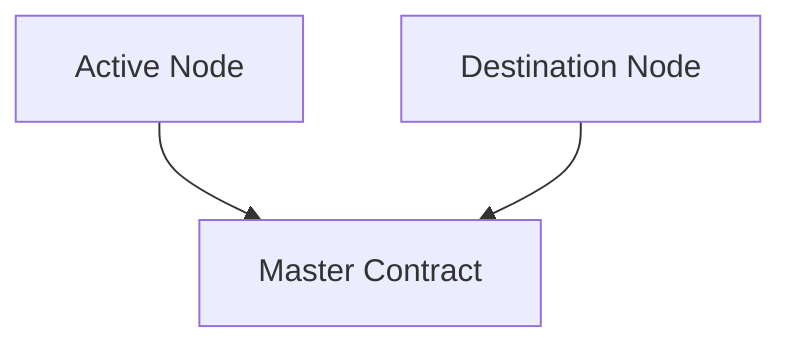
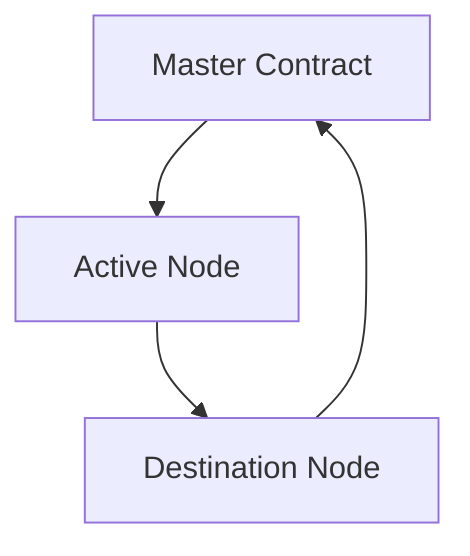

# Warp Assets


Of course becouse the protocol is permissionless, anyone can start a warp vault.

Warp Vault is completed in 2 steps


#### Step 1 - Retrieve nodes data.

In the first step, the necessary information from both nodes is sent to the master contract.




```solidity filename="Node.sol" {}
    function sendAaveData() external
```

<div className="mt-10"><strong>Fees</strong></div>

Caller will pay the node chain regular fees, and an extra fee in LINK to preform sending node data to master node

 


#### Step 2 - Start Warp Vault

Once the master contract has the necessary information to perform the warp, it will carry out the [necessary checks to approve the warp](/docs/masterContractRoles/warp-requirements).
The time window to execute the warp will be 2 hour from the time the node information arrives at the master contract.  
If the necessary requirements are met, the warpAssets() function will be avaliable to call.
Once WArp inits, no other call to warpAssets will be allowed in next 24h.  
The command will reach the active node and the funds will automatically be withdrawn from the current AAVE pool and transferred to the USDC bridge. At the same time, the necessary data will also be sent to the destination node.  
Once the Assets are allocated in the new chain, the new active node will send to master contract the command to resume operations normaly.


```solidity filename="MasterNode.sol" {}
    function warpAssets(
        uint64 _destinationCCIPid,
        address _destinationNodeAddress
    ) external
```

<strong>Inputs:</strong>

<span className="underline">uint32 _destinationCCIPid:</span> CCIP Identificator of new node vault is warping

<span className="underline">uint64 _destinationNodeAddress:</span>Address new node vault is warping

<div className="mt-10"><strong>Fees</strong></div>

Caller will pay the master node chain regular fees, and an extra fee in LINK to preform the warp

<div className="mt-10"><strong>Read this!!</strong></div>

Once warp vault is approved and performed, master node operation will halt. So <strong>all withdraws will be halted</strong> untill next node becomes active. Notice that this can take nearly 1 hour.

### Once Warp Is Initiated:

Once the Warp has been initiated, the order will arrive at the active node, which will process it to send the funds to the newly designated node. The fees necessary for this operation will be deducted from the general vault.

Once the funds reach the newly designated node, the node will automatically supply these funds to AAVE to immediately start earning new interest. It will also send the order to the master contract to resume withdrawal operations. These fees will also be covered by the vault.


 


### Active Node and Master Contract in same chain


In the case that the Active Node and the Master Contract are on the same blockchain, the process becomes much simpler.

Naturally, the Master Contract will not need to retransmit a command via Link CCIP since they are on the same blockchain. Similarly, the call to `warpAssets()`, `withdraw()` and `deposit()` will not need to be broadcasted between blockchains.

The user does not need to take any action regarding this situation; the contracts will act accordingly based on whether the node is on the same blockchain as the Master Contract or not.


The main difference is that if the master node and the node are on the same chain, the LINK fees will not be necessary.


