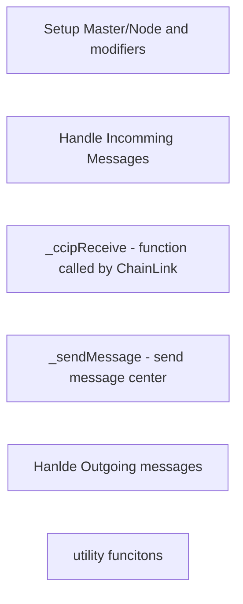

# Protocol Structure

Warp Yield is a protocol based on two contracts:

1. [MasterNode.sol](https://github.com/ddrr1337/warp_aave/blob/main/contracts/MasterNode.sol)
2. [Node.sol](https://github.com/ddrr1337/warp_aave/blob/main/contracts/Node.sol)

#### Master.sol

The Master contract is responsible for the following roles:

1. Executing warp orders to shift the vault's funds to a blockchain with better returns.
2. Maintaining all user accounting and handling the logic of each user's balances.
3. Handling user requests for funds [withdrawal](/docs/masterContractRoles/withdraw)

#### Node.sol

The Node contract handles the following roles:

1. Sending critical data to the Master contract to facilitate successful fund warp.
2. Executing USDC [deposits](/docs/nodeContractRoles/deposits) from participating users.  

#### Contract structure

Both MasterNode.sol and Node.sol follow this same scheme:

Contract structure MasterNode.sol and Node.sol

#### Link token

Why does Warp Yield need the Link token?  

Warp Yield sends commands between contracts and across blockchains using Chainlink CCIP services. These services ensure the correct sending and receiving of commands across blockchains. For this reason, when a user wants to make a deposit or withdrawal, they must pay an additional gas cost in the form of the Link token to ensure the successful broadcast of their command.

