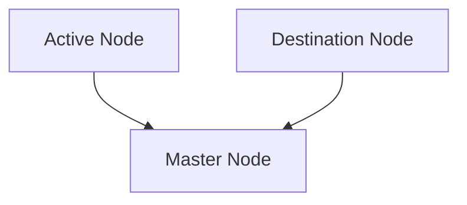
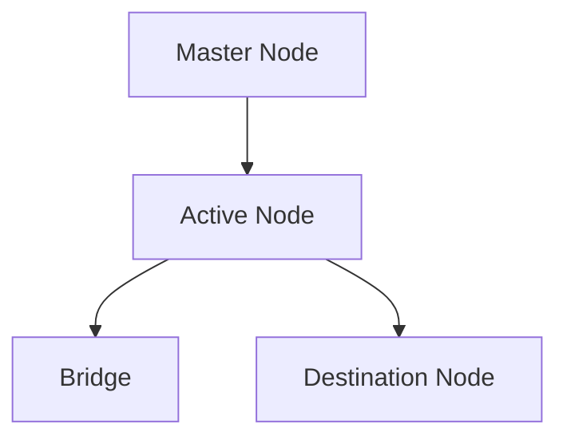
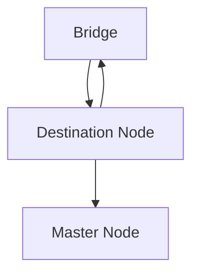

# Warp Assets

Warp Vault is completed in 3 steps, each of which corresponds to a call to a contract.

#### Step 1 - Retrieve nodes data.

In the first step, the necessary information from both nodes is sent to the master contract.

#### Step 2 - Start Warp Vault

Once the master contract has the necessary information to perform the warp, it will carry out the necessary calculations to approve the warp.
The time window to execute the warp will be 1 hour from the time the node information arrives at the master contract.  
If the necessary requirements are met, the warpAssets() function will be avaliable to call.  
The command will reach the active node and the funds will automatically be withdrawn from the current AAVE pool and transferred to the USDC bridge. At the same time, the necessary data will also be sent to the destination node.

#### Step 3 - Claim assets from bridge

Once the transfer through the USDC bridge is completed, the function claimAssetsFromBridge() will ready to call.  
This will initiate a process in which the USDC from the bridge will be taken, placed in AAVE supply to start receiving yield immediately.  
At the same time, in the same call, the command to resume withdrawals will be sent to the master contract.  
The master contract will automatically process the command and resume operations normally on the new blockchain.

