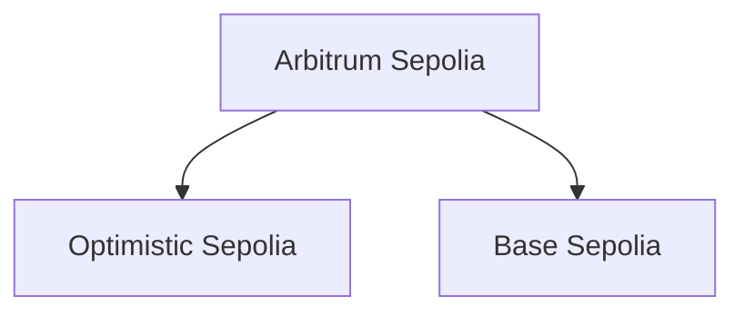

# WARP YIELD IS IN TEST MODE!

##### DONT TRY TO DEPLOY ON MAINNET, PROTOCOL IS NOT AUDITED YET!!

For presentation and testing purposes, Warp Yield is deployed on EVM testnets.

DO NOT!! attempt to deploy this protocol on a mainnet without auditing it first!!

#### Location of the master node and the nodes in test mode.

#### Important Notes on the Test Deployment.

Warp Yield is in test mode. This has important implications.

Warp Yield will not perform any checks to warp to another node.
Warp Yield in test mode is deployed on 3 blockchains:

1. Aribitrum Sepolia
2. Optimistic Sepolia
3. Base Sepolia

Warp Yield can operate on any network that ChainLink CCIP supports. You can see the networks currently supported by ChainLink here. [View Blockains](https://docs.chain.link/ccip/supported-networks/v1_2_0/mainnet)

